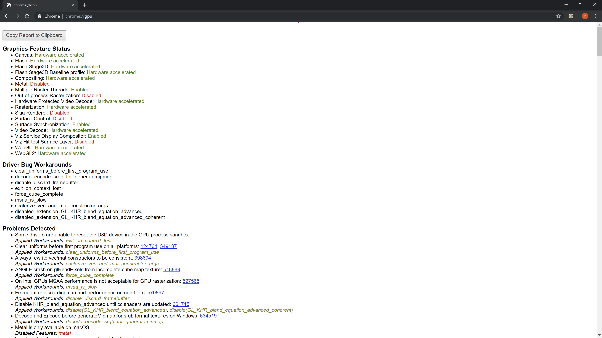
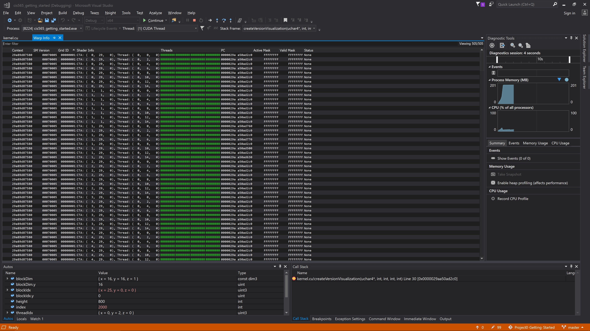

Project 0 Getting Started
====================

**University of Pennsylvania, CIS 565: GPU Programming and Architecture, Project 0**

* Author : Kushagra
  * [LinkedIn](https://www.linkedin.com/in/kushagragoel/)
* Tested on : Windows 10, i7-9750H CPU @ 2.60GHz 16GB, GTX 1650 4GB (Personal Computer)  

***
**DXR Support Test**  
The project switches to the FallBack layer to use ray tracing as GTX 1650 does not support DXR.
  
***
**WebGL Support Test**  
  
***
**GPU Test**  
  

***
**Performance Analysis Timeline**  
  
***
**Breakpoint Debugging with Nsight**  
  
